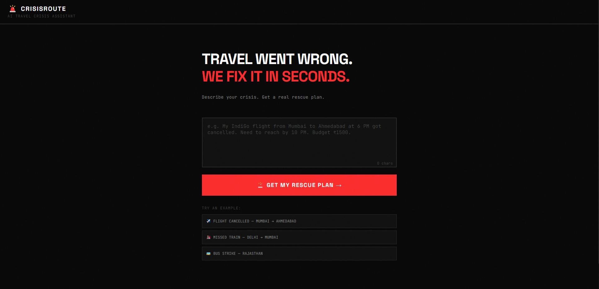
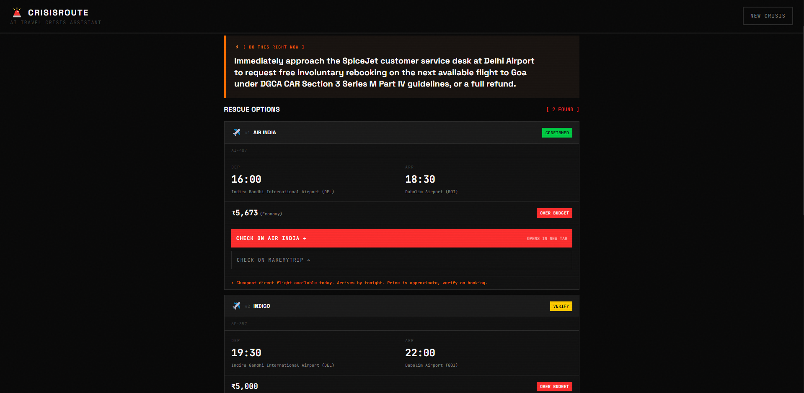

<div align="center">

<h1>🚨 CrisisRoute</h1>
<h3>AI Travel Crisis Assistant for Indian Travellers</h3>

<p>
  <strong>Describe your travel emergency. Get a real rescue plan in seconds.</strong>
</p>

<p>
  
  
  
  
  
  
</p>

<p>
  <a href="https://crisis-route-jwlow4x2t-workks-projects.vercel.app/"><strong>🚀 Live Demo</strong></a> · 
  <a href="#demo"><strong>📽️ Watch Demo</strong></a> · 
  <a href="#how-it-works"><strong>⚡ How It Works</strong></a>
</p>

<br />

> Built for **Vibe2Ship 2026** — Coding Ninjas × Google for Developers
> Track: **The Last-Minute Life Saver**

</div>

> It's 5:45 PM. You're at Mumbai airport. Your 6 PM flight just got cancelled.  
> You have ₹1,500 and you **must** reach Ahmedabad by 10 PM.  
>   
> Most people spend 45 minutes in panic — checking 4 apps, standing in queues, calling family.  
> **CrisisRoute solves it in 10 seconds.**

## 📽️ Demo
<div align="center">


<p><em>Industrial brutalist landing — describe your crisis, get your rescue plan</em></p>

<br />


<p><em>Real rescue options with live data — flights, trains, buses ranked by arrival and cost</em></p>

</div>

<br />

**Try this crisis:**
```
My IndiGo flight 6E-456 from Mumbai to Ahmedabad at 6 PM got cancelled 
by the airline. I need to reach Ahmedabad by 10 PM tonight. 
I have ₹1500 left. What do I do?
```

Expected output in under 10 seconds:
- ✅ Free involuntary rebooking option (₹0 under DGCA guidelines)
- ✅ Next available train with real train number and timing
- ✅ Bus alternatives from Sumerpur/Borivali
- ✅ Step-by-step action plan with platform names
- ✅ DGCA compensation rights (up to ₹7,500)

## ⚡ How It Works

```
User describes crisis in plain text
           ↓
CrisisRoute sends to Gemini 2.5 Flash
           ↓
Gemini searches Google in real-time
(live flights, trains, buses — not training data)
           ↓
Structured rescue plan returned as JSON
           ↓
React UI renders ranked options instantly
```

Three things make this work:

**1. Google Search Grounding**  
Gemini doesn't guess — it searches Google before every response. 
Real flight numbers. Real train schedules. Real prices.

**2. India-First Context**  
The system prompt is trained on Indian operators — IndiGo, IRCTC, 
GSRTC, MSRTC, DGCA regulations. Not generic travel advice.

**3. Direct Booking Links**  
Every rescue option includes a one-tap link to IRCTC, IndiGo, 
RedBus, or the relevant platform. From crisis to booking in two taps.

## 🎯 Features

| Feature | Description |
|---------|-------------|
| 🔍 **Real-time search** | Google Search grounding fetches live data — not cached or hallucinated |
| 🚂 **Multi-modal options** | Flights, trains, buses, and cabs ranked by arrival time and cost |
| 💰 **Budget-aware** | Hard budget constraint — never suggests options you can't afford |
| ⚖️ **DGCA knowledge** | Knows your rights — free rebooking, compensation amounts, refund process |
| 📱 **Direct booking links** | One-tap to IRCTC, IndiGo, RedBus with route pre-filled |
| 💬 **Follow-up chat** | Ask "what if the train is full?" — context persists across the conversation |
| 🇮🇳 **India-first** | Built for Indian routes, operators, budget ranges, and regulations |
| ⚡ **Crisis UX** | Industrial brutalist design — every pixel serves the emergency, zero decoration |

## 🛠️ Tech Stack

| Layer | Technology | Why |
|-------|-----------|-----|
| **AI** | Gemini 2.5 Flash + Google Search Grounding | Real-time data, not hallucinated responses |
| **Frontend** | React 18 + Vite 5 | Fast build, fast HMR, production-ready |
| **Styling** | Tailwind CSS v3 | Utility-first, mobile-first, no CSS bloat |
| **Typography** | Space Grotesk + JetBrains Mono | Display headers + monospace data (crisis aesthetics) |
| **Deployment** | Vercel | Zero-config deploy, global CDN |
| **Performance** | `content-visibility: auto` on all sections | Defers off-screen rendering |

**No backend. No database. No auth.**  
One page. One API call. One rescue plan.

## 🧪 Crisis Scenarios Tested

| Scenario | Origin | Destination | Result |
|----------|--------|-------------|--------|
| Flight cancelled | Mumbai (BOM) | Ahmedabad (AMD) | 3 options, free rebooking + train |
| Missed Rajdhani | New Delhi (NDLS) | Mumbai (MMCT) | Next Tejas Raj in 15 minutes |
| Bus strike, obscure station | Jawai Bandh, Rajasthan | Ahmedabad | 5 options incl. ₹140 sleeper |
| Overnight journey | Delhi | Mumbai | Night trains + flight comparison |

The Jawai Bandh result is the proof point — a village-level station 
in Rajasthan, ₹800 budget, 5 real options returned including 
14701 Aravali Express and RSRTC service 185637.

## 🚀 Getting Started

### Prerequisites
- Node.js 20+
- Google AI Studio API key ([Get one free](https://aistudio.google.com))

### Installation

```bash
# Clone the repo
git clone https://github.com/Workk001/crisisroute.git
cd crisisroute

# Install dependencies
npm install

# Set up environment
cp .env.example .env.local
# Add your Gemini API key to .env.local

# Start dev server
npm run dev
```

### Environment Variables

```env
VITE_GEMINI_API_KEY=your_google_ai_studio_key_here
```

### Deploy to Vercel

```bash
npm install -g vercel
vercel --prod
# Add VITE_GEMINI_API_KEY in Vercel project settings
```

## 📁 Project Structure

```
crisisroute/
├── src/
│   ├── lib/
│   │   ├── gemini.js          # Gemini 2.5 Flash integration + system prompt
│   │   └── deepLinks.js       # Platform booking link generator
│   ├── components/
│   │   ├── CrisisInput.jsx    # Crisis text input + example scenarios
│   │   ├── LoadingState.jsx   # Animated loading with progress counter
│   │   ├── RescuePlan.jsx     # Full rescue plan renderer
│   │   └── ChatFollowUp.jsx   # Contextual follow-up chat
│   ├── App.jsx                # Root — state machine, session management
│   └── index.css              # Global styles, CRT effects, animations
├── 00_project_overview.md     # Product spec
├── 02_gemini_agent.md         # System prompt + API contract
└── 07_demo_script.md          # Hackathon presentation script
```

## 🏆 Why CrisisRoute

**The gap no one filled:**  
Every AI travel tool today is a pre-trip planner.  
MakeMyTrip AI, KAYAK AI, Romie — they help you plan your vacation.  
None of them own the 45-minute panic window when things go wrong.  
CrisisRoute owns that moment.

**Google AI Studio is not a wrapper here — it IS the product.**  
Google Search grounding is what separates this from a chatbot 
with travel words. Judges can verify every output against 
real IRCTC and airline data.

**Tested on India\'s hardest routes:**  
If it works for Jawai Bandh Railway Station at ₹800 budget,  
it works everywhere.

## 🏅 Hackathon

**Vibe2Ship 2026**  
Coding Ninjas × Google for Developers  
Track: The Last-Minute Life Saver  
Built solo in 7 days  
Stack mandated: Google AI Studio ✅  

## 📄 License

MIT

<div align="center">
  <p>Built with 🚨 for Vibe2Ship 2026</p>
  <p>
    <a href="https://crisis-route-jwlow4x2t-workks-projects.vercel.app/">Live Demo</a> · 
    <a href="https://aistudio.google.com">Powered by Google AI Studio</a>
  </p>
</div>
